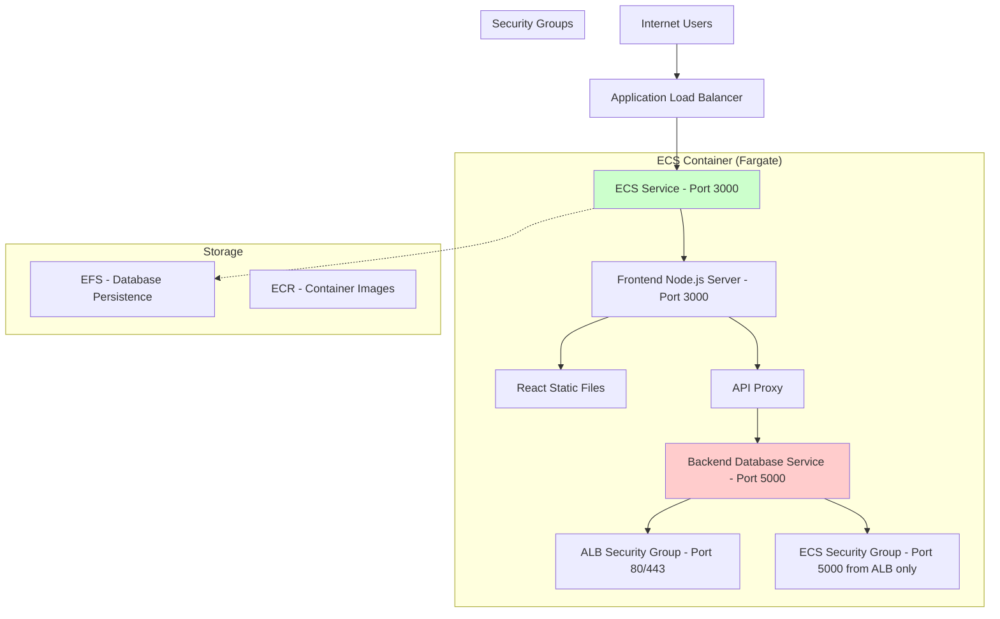

# MiniURL Architecture - Secure Deployment

## 🏗️ **Architecture Overview**



## 🔒 **Security Architecture**

### **✅ SECURE: What's Exposed**
- **Port 3000**: Frontend Node.js application (exposed to ALB)
- **ALB Ports 80/443**: Public HTTPS/HTTP access
- **Health Check**: `/health` endpoint on frontend service

### **🚫 SECURE: What's NOT Exposed**
- **Port 5000**: Backend database service (internal to container only)
- **Database**: SQLite file only accessible within container
- **Internal communication**: Frontend-to-backend communication stays internal
- **File system**: Protected by container isolation

## 📊 **Request Flow**

### **Frontend Requests (React App)**
```
User Browser → ALB (Port 80/443) → Frontend Service (Port 3000) → React Static Files
```

### **API Requests**
```
User Browser → ALB (Port 80/443) → Frontend Service (Port 3000) → Proxy → Backend Service (Port 5000) → SQLite (Internal)
```

### **Internal Communication**
```
Frontend Service (Port 3000) ←→ Backend Database Service (Port 5000)
                                            ↓
                                  SQLite File (/app/data/database.sqlite)
```

### **Database Access**
```
ONLY: Backend Service (Port 5000) → SQLite File (/app/data/database.sqlite)
BLOCKED: External → Port 5000 (No network exposure)
BLOCKED: External → Database (No direct access)
```

## 🐳 **Container Configuration**

### **Dockerfile Security**
```dockerfile
# ✅ SECURE PRACTICES:
USER nodejs                    # Non-root user
EXPOSE 3000                    # Only application port
ENV DB_PATH=/app/data/...      # Internal database path
HEALTHCHECK                    # Monitoring support

# 🚫 NOT EXPOSED:
# - No database ports (3306, 5432, 5000, etc.)
# - No SSH/management ports (22, etc.) 
# - No development debug ports
```

### **Multi-Service Architecture**
```javascript
// ✅ FRONTEND SERVICE (Port 3000):
app.use('/api', proxy(backend))     // Proxy API to backend
app.use('/auth', proxy(backend))    // Proxy auth to backend
app.use('/urls', proxy(backend))    // Proxy URLs to backend
app.use(express.static(...))        // Serve React static files
app.get('*', sendReactApp)          // React Router support

// ✅ BACKEND SERVICE (Port 5000 - Internal):
app.use('/api/*')                   // API endpoints
app.use('/auth/*')                  // Authentication
app.use('/urls/*')                  // URL management
// Direct database access (SQLite)

// 🚫 NO EXTERNAL ACCESS TO BACKEND:
// Port 5000 not exposed outside container
// Only frontend service can communicate with backend
```

## 🌐 **Network Security**

### **ALB Security Group**
- **Ingress**: Port 80 (HTTP) + 443 (HTTPS) from Internet
- **Egress**: Port 3000 to ECS containers only

### **ECS Security Group** 
- **Ingress**: Port 3000 from ALB only (no direct access)
- **Egress**: All outbound (for AWS API, Docker pulls)

### **Database Security**
- **SQLite**: File-based, container-internal only
- **Persistence**: EFS mounted volume (encrypted)
- **Access**: Application code only, no network exposure

## 🚀 **Deployment Architecture**

### **Single-Port Design Benefits**
1. **Simplified Load Balancing**: One target group, one health check
2. **Enhanced Security**: Minimal attack surface
3. **Easy SSL Termination**: ALB handles HTTPS, backend uses HTTP
4. **Cost Effective**: Single ALB for entire application

### **Production Considerations**
- **SSL/TLS**: Terminated at ALB level
- **Scaling**: ECS auto-scaling based on CPU/memory
- **Monitoring**: CloudWatch logs + ALB access logs
- **Backup**: EFS automatic backups + snapshot capability

## 📋 **Port Summary**

| Component | Port | Protocol | Access | Purpose |
|-----------|------|----------|--------|---------|
| ALB | 80 | HTTP | Internet | Public HTTP access |
| ALB | 443 | HTTPS | Internet | Public HTTPS access |
| Frontend Service | 3000 | HTTP | ALB Only | React app + API proxy |
| Backend Service | 5000 | HTTP | Container Only | Database operations + API |
| SQLite Database | - | File | Backend Only | Data storage (no network) |

## 🔍 **Security Validation**

### **External Access Test**
```bash
# ✅ SHOULD WORK (via ALB):
curl http://your-alb-url/                    # Frontend React app
curl http://your-alb-url/api/health         # API (proxied to backend)
curl http://your-alb-url/health             # Frontend health check

# 🚫 SHOULD FAIL (direct access blocked):
curl http://container-ip:3000/              # Direct frontend access
curl http://container-ip:5000/              # Direct backend access
telnet container-ip 5000                    # Backend port
telnet container-ip 3306                    # Database port
```

### **Internal Container Test**
```bash
# ✅ WORKS INSIDE CONTAINER:
wget localhost:3000/health                  # Frontend health check
wget localhost:5000/api/health             # Backend health check  
curl localhost:3000/api/health             # Proxy test (frontend → backend)
sqlite3 /app/data/database.sqlite          # Direct database file access

# ✅ SERVICE COMMUNICATION:
# Frontend (3000) → Backend (5000) → SQLite
```

This multi-service architecture ensures your **frontend Node.js application is properly exposed to the ALB on port 3000** while keeping your **backend database service completely internal on port 5000**! 🎉

### **🎯 Key Benefits:**
- ✅ **Separation of Concerns**: Frontend and backend services are clearly separated
- ✅ **Enhanced Security**: Backend database service not accessible externally
- ✅ **Scalability**: Services can be independently monitored and optimized
- ✅ **Clear Communication**: Frontend proxies requests to backend service
- ✅ **Single Container**: Both services run efficiently in one container 