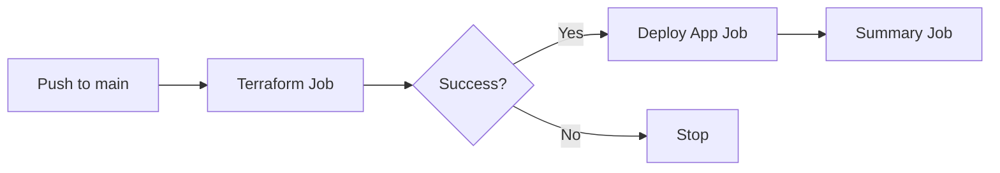
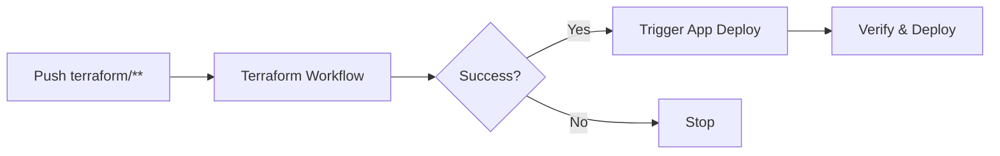
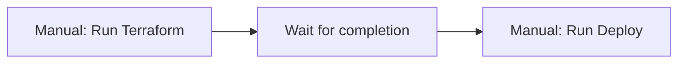

# GitHub Repository Setup for MiniURL Deployment

## 🚨 **Fix "Resource not accessible by integration" Error**

This error occurs when GitHub Actions don't have proper permissions. Follow these steps:

## ✅ **WORKFLOW OPTIONS: Choose Your Deployment Strategy**

I've created multiple workflow options for different deployment needs:

### **Option 1: Complete Deployment (Recommended)**
- **File**: `.github/workflows/deploy-complete.yml`
- **Description**: Single workflow that runs Terraform first, then deploys application
- **Triggers**: Push to main/master OR manual dispatch
- **Benefits**: ✅ Guaranteed order ✅ Single workflow ✅ Clear dependencies

### **Option 2: Automatic After Terraform**
- **File**: `.github/workflows/deploy-after-terraform.yml`
- **Description**: Automatically deploys app after Terraform workflow completes
- **Triggers**: When "Terraform Infrastructure (Simple)" workflow succeeds
- **Benefits**: ✅ Automatic ✅ Separate workflows ✅ Infrastructure verification

### **Option 3: Separate Manual Workflows**
- **Files**: `.github/workflows/terraform-simple.yml` + `.github/workflows/deploy-simple.yml`
- **Description**: Run each workflow manually in order
- **Triggers**: Manual dispatch or push to specific paths
- **Benefits**: ✅ Simple ✅ Manual control ✅ Independent operation

### **Recommended Setup:**
1. **For production**: Use Option 1 (Complete Deployment)
2. **For development**: Use Option 2 (Automatic After Terraform)
3. **For testing**: Use Option 3 (Manual Workflows)

## 1. **Set Up Repository Secrets**

Go to your GitHub repository → **Settings** → **Secrets and variables** → **Actions**

Add these secrets:

```
AWS_ACCESS_KEY_ID: your-aws-access-key-id
AWS_SECRET_ACCESS_KEY: your-aws-secret-access-key
```

**How to get AWS credentials:**
1. Go to AWS IAM Console
2. Create a new user for GitHub Actions
3. Attach the policies listed below
4. Create access keys for the user
5. Copy the keys to GitHub secrets

## 2. **Create Production Environment (Optional)**

Go to **Settings** → **Environments** → **New environment**

1. Name: `production`
2. Add environment protection rules if needed
3. Add the same AWS secrets to the environment

## 3. **Repository Permission Settings**

Go to **Settings** → **Actions** → **General**

Ensure these are enabled:
- ✅ **Allow all actions and reusable workflows**
- ✅ **Read and write permissions** for GITHUB_TOKEN
- ✅ **Allow GitHub Actions to create and approve pull requests**

## 4. **Quick Fix for Immediate Testing**

If you want to test immediately without setting up environments:

### Option A: Comment Out Environment Requirements

Edit your workflow files and comment out these lines:
```yaml
# environment: production  # Comment this out
```

### Option B: Remove PR Commenting

The PR commenting feature requires special permissions. Comment out the "Comment PR with Terraform Plan" step in `.github/workflows/terraform.yml`

## 5. **AWS IAM User Setup**

Create an IAM user with these policies:
- `AmazonECS_FullAccess`
- `AmazonEC2ContainerRegistryFullAccess` 
- `AmazonVPCFullAccess`
- `IAMFullAccess` (for creating roles)
- `CloudWatchLogsFullAccess`
- `ElasticLoadBalancingFullAccess`
- `AmazonElasticFileSystemClientFullAccess`

## 6. **Test Your Setup**

1. Push a small change to trigger the workflow
2. Check **Actions** tab for workflow runs
3. If still failing, check the specific error in the workflow logs

## 7. **Common Issues & Solutions**

| Error | Solution |
|-------|----------|
| `Resource not accessible` | Set up secrets and environment |
| `403 Forbidden` | Check repository permissions |
| `No such environment` | Create environment or comment out requirement |
| `Invalid AWS credentials` | Verify AWS IAM user and keys |

## 8. **Minimal Working Configuration**

For testing, you can start with this minimal workflow configuration:

```yaml
permissions:
  contents: read
  id-token: write
  # Remove pull-requests: write if not needed
```

And comment out:
```yaml
# environment: production
```

Once everything works, you can gradually add back the advanced features.

## 9. **Next Steps After Setup**

1. **First, run Terraform**: The infrastructure must be created before deploying the app
   ```bash
   cd terraform
   terraform init
   terraform plan
   terraform apply
   ```

2. **Then deploy the application**: The deployment workflow will build and deploy your container

3. **Monitor the deployment**: Check the AWS ECS console to see your running service

## 10. **Deployment Order & Usage**

### **How the Workflows Work:**

#### **Option 1: Complete Deployment**


**Usage:**
- Push any changes to main branch → Automatic full deployment
- Manual trigger → Choose terraform action (plan/apply/destroy)

#### **Option 2: Automatic Chain**


**Usage:**
- Push terraform changes → Infrastructure deployed → App auto-deploys
- Push app changes → App deploys directly (if infrastructure exists)

#### **Option 3: Manual Control**


**Usage:**
- Manually run "Terraform Infrastructure (Simple)"
- Manually run "Deploy Application (Simple)"

### **🚀 Quick Start Commands:**

1. **First deployment**: Use complete deployment workflow
2. **Infrastructure updates**: Push to `terraform/` folder  
3. **App updates**: Push to any other folder
4. **Manual control**: Use "Actions" tab → "Run workflow"

### **🎯 Execution Order:**

🔧 **Always**: Infrastructure First (Terraform)  
📦 **Then**: Application Deployment (Docker + ECS)  
📋 **Finally**: Summary and URL display

The workflows automatically enforce this order and prevent application deployment if infrastructure fails. 